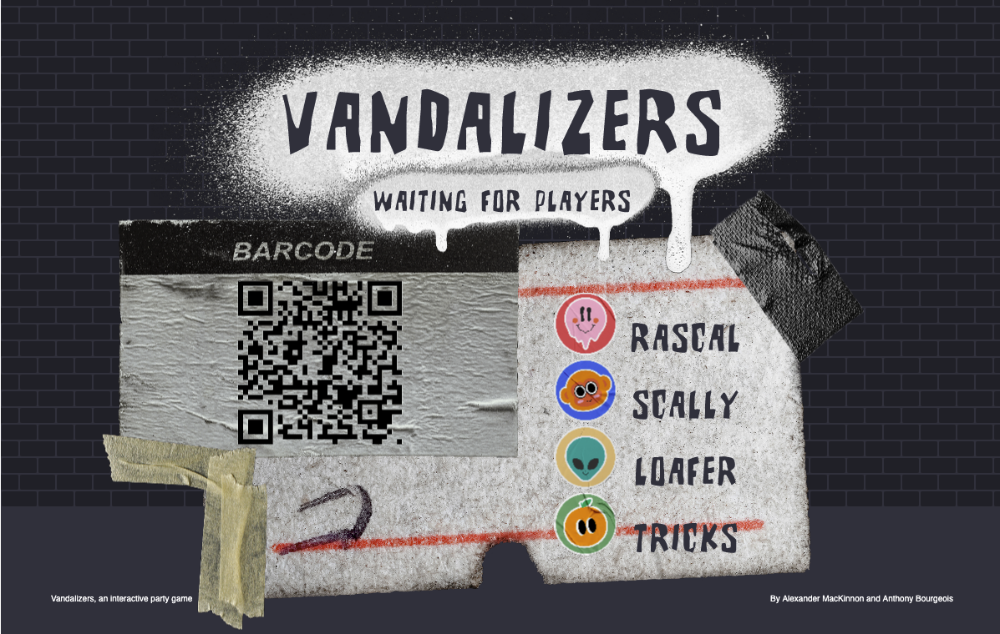
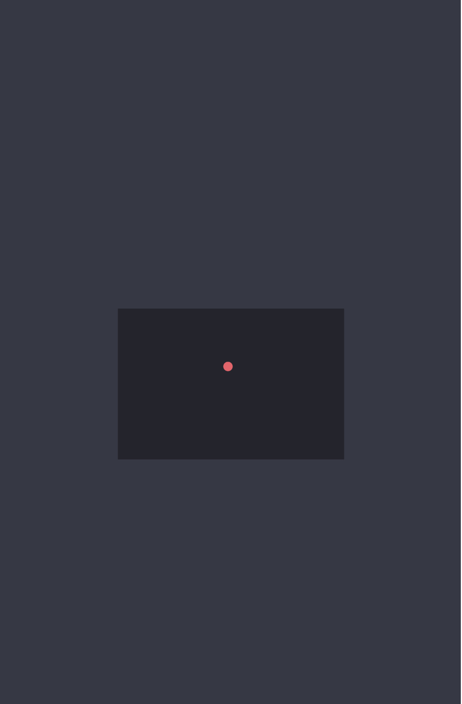
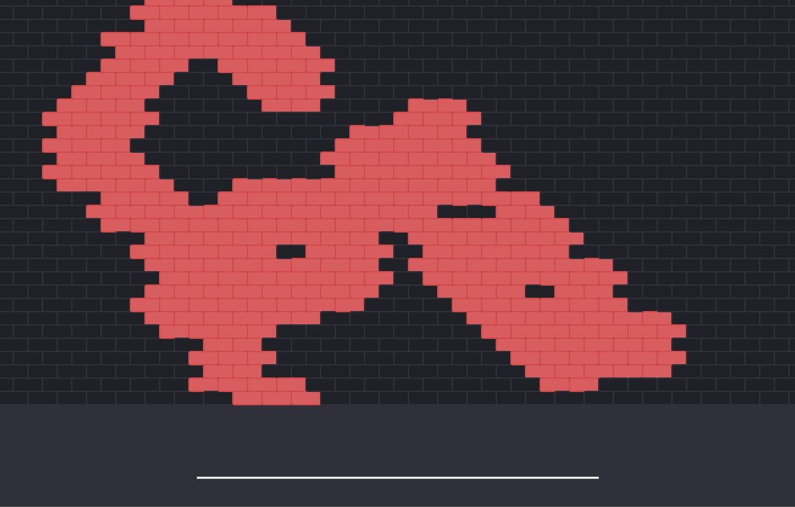
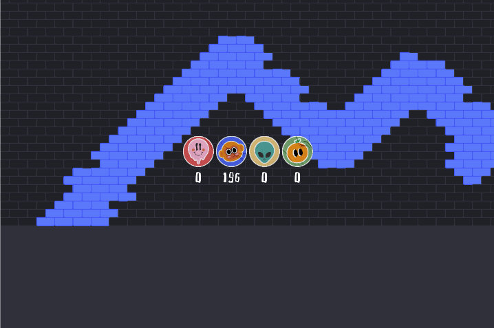

# Vandalizers

A Playful Interaction
by Alexander MacKinnon & Anthony Bourgeois

## Live Demo

A live demo is available at the following links

- [Receiving Screen](https://vandalizers.mackinnonmedia.com/receiver/) (open on a large display that each player can see):
- [Player Screens](https://vandalizers.mackinnonmedia.com/player)(open on mobile devices):

## About the Game

Vandalizers is a 2-4 player interactive party game in which users compete in a brick wall vandalization contest. The objective is to conquer with the player's assigned color the most amount of territory on the brick wall by throwing paint. After a 30 second showdown, the bricks are counted by the system to see how many bricks each player painted in that timeframe, and declares the winner based on the amount of bricks controlled.

The game is built into an HTML canvas using P5.js, a JavaScript animation library. MQTT connection was used to make the player screens to receiving screen communication possible. The iPhone's gyroscope handles where the user throws paint on the main screen.

## How to Play

To play, there needs to be a main screen, preferably large and accessible so that everyone who is playing can see, along with mobile phones that have a built-in gyroscope which will act as controllers for the game.

#### Lobby Screen

On startup, the player is introduced on the receiving screen to a click prompt, which launches the game and brings the users the lobby screen. This acts as a waiting room while everyone who is playing connects to the server. **When everyone is ready to play, any key can be pressed while in the lobby to start game**.

#### Mobile Display

Players will see on their phones after selecting their player the following mobile display. This is a shooting sensor that will indicate where on the screen the user is aiming. **To shoot a paint ball, the player must tap on their phone**. Where the ball on the sensor is located when the phone is tapped is where it will end up on the main screen.

#### Game Screen

As players throw paint, the wall will get filled up with different colors!

#### End Results

At the end of the 30-second showdown, bricks are counted and compiled into scores shown on screen. **From there, the user may click anywhere on the screen to go back to the lobby and start a new game.**

### Inspirations

Several inspirations were influencial for the design of the game. Icey towers were brought to mind, a freeware video game made by a Swedish developper. The infamous Jackbox games that are known for their multiplayers gameplay, and Little Big Planet for the mix of design between 2D and 3D artstyle. 

### Future Iterations

Eventually, adding more challenges and obstacle during the gameplay. We wanted to punish the player with a cop sirens system where if you were pressing while the audio is playing, the player would be restrained for a few seconds. Also, a way that some of the brick are replaced and removed so that it creates more free spots mid-game. And finally, more gameplay from the player end where the throwing of the splatter has more personality (swiping to send the ball, spining the ball to create larger AOE) and prehaps a way to add a crosshair to the receiver end. 

### Credits

Menu Music: [Easy Cheesy from Zapsplat](https://www.zapsplat.com/music/easy-cheesy-fun-up-tempo-funky-retro-action-arcade-game-music-great-for-menu-or-pause-sections/ "Easy Cheesy link title")
Gameplay Music: [courtesy of Panda Beats Music - 1UP](https://pandabeatsmusic.com/ "Link to panda beats music website")
Font: [Brutality from 1001Fonts.com](https://www.1001fonts.com/brutality-font.html "Link to Brutality font")